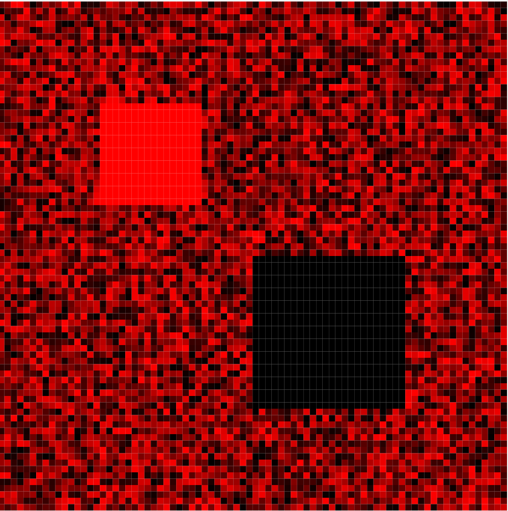
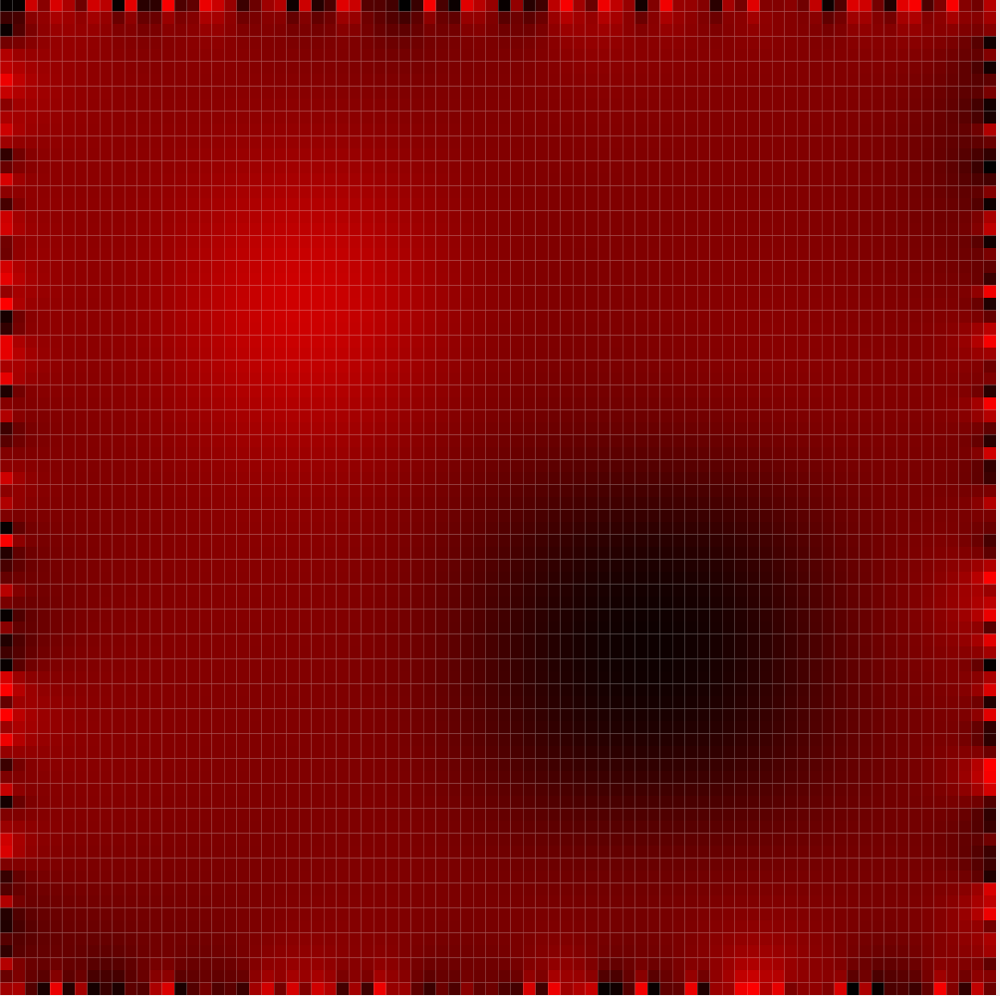

# Discrete Heat Equation

## Introduction

This little project is a test-of-concept for integration of [Futhark](https://futhark-lang.org) with [Elm](https://elm-lang.org)  The idea is to off-load computationally expensive work to Futhark, which can use the host's GPU.  The current idea is to run a Python server which calls Futhark code to do the expensive work.  This work is done on demand when the server receives a GET request from the client.  The server holds a `state` which in the example here is a 2D array of floats. On each request, the server sends the current value of `state` to the client, then uses Futhark to perform the update `state -> f(state)` for some function `f` of interest.

(For some othe work on Futhark, see [this repo](https://github.com/jxxcarlson/pca-fut)).

The two images below demonstrate the operation of the app.  The first image displays a random temperature field with a one hot spot and one cold spot.  The second image shows the system some time later, after heat has diffused from htter regions to colder ones.




## Project structure

The Futhark and server files are in `./futhark-server`.  The files for (the start of) the Elm client are in `./src`

## Running the example I

There are now two examples, one in the `master` branch of the project, 
the other in the `png` branch.

Do the following in `./futhark-server/`

```
$ futhark pyopencl --library heat.fut
$ python server.py

Next, in the root directory, to 

``1
$ elm make src/Main.elm
```

Then open `index.html` to run the app.

## Running Example II.

Same procedure. Be sure to do `python server.py again`


## Comparison of I and II.

In both versions, the computation of the next temperature state
is carried out by Futhark on the GPU.  In version I, the computed
image is sent from the Python backend to the Elm front end as any array
of floats. It is decoded by the front end and dsplayed as an SVG image.  Display 
of the SVG image is the most time consuming part of the process by far.
A 100x100 grid results in 10,000 cells, each of which gives rise to a 
DOM node.  A 10,000 element DOM triee is already problematic; hence we
explore other solutions. One is to create a PNG image on the back-end
that represents the computed data.  This is the approach we explore in version II.

## Server.py

Server.py starts up by creating an instance `myData` of the class `Data`.  This class has one instance variable, `state`, which is initialized with a 2D numpy array of float32.  It also has one method, `step`, which applies a transformation `state -> f(state)` to update the state variable.

When `server.py` receives a GET request at http://localhost:8001, it (1) replies with a string representation of `myData.state,` (2) updates `myData.state` using the `step` method. (This process needs to be improved, e.g., by sending binary data rather than a string so as not to incur conversion costs.)

The update function is the discrete heat kernel. It is implemented in `heat.futhark`  To make the code in this file available to server.py, run the command

   $ futhark pyopencl --library heat.fut

It will create a file `heat.py` which is imported
here.

PLANS: the next step is to write an Elm client that will talk to server.py and produce a visual display (heat map) of the data received.  See https://jxxcarlson.github.io/app/heat-model.html for a pure Elm version.  The Elm + Python + Futhark implementation will allow one to work with much larger heat fields (say, 100x100). All this is really a test for other models based on the state -> f(state) idea which are computationally more expensive. If there were a pure Elm bridge
 o Futhark, that would be awesome.

 ## Futhark repl

The Futhark repl allows one to easily test code:

 ```
 $ futhark repl
 [1]> :load heat.fut
 [1]> let data = [[0, 0, 0], [0, 1, 0], [0, 0, 0]]:[3][3]f32
 [2]>  main 1 0.5 data
 [[0.0f32, 0.0f32, 0.0f32], [0.0f32, 0.5f32, 0.0f32], [0.0f32, 0.0f32, 0.0f32]]

 ```

## Compiling Futhark code

Futhark code can be compiled to various targets:

```
$ futhark c heat.fut
$ futhark opencl heat.fut
$ futhark pyopencl --library heat
```

## Futhark FFI

```
futhark opencl --library  heat.fut
build_futhark_ffi heat
python test.py
```

Use `pip install futhark-ffi` for https://github.com/pepijndevos/futhark-pycffi


[pycffi Issue](https://github.com/pepijndevos/futhark-pycffi/issues/8)

## Random references

https://github.com/diku-dk/futhark-with-fangs
